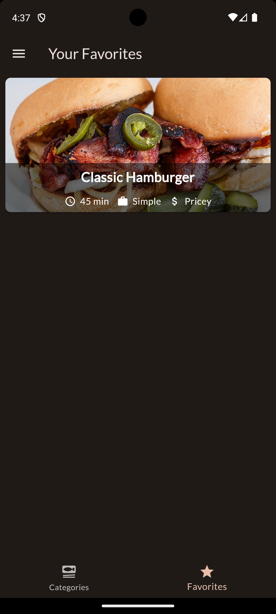

# Meals App (Animation)

Meals app is a Flutter app that helps you find the right meal for your needs! Be it for your eating habbits like vegan or vegetarian or simply the type of food you like most. We got everthing from italian to asian. Ingredients and recepies included. You can even bookmark your favorite meal to have quick and easy access to it! This code was produced during the completion of the Flutter course [A Complete Guide to the Flutter SDK & Flutter Framework for building native iOS and Android apps](https://www.udemy.com/course/learn-flutter-dart-to-build-ios-android-apps/learn/lecture/37130436#overview).

## Basic functionality
- Drawer menu to switch between meal categories and filter options.
- Filter the meals based on gluten free, lactose free, vegetarian and vegan.
- Shows meals depending on their category.
- Shows meals in detail with a picture, ingredients and the recepie.
- Favorite meals and being able to view just your favorited meals.

### Screenshots 

  
  
  
  
  
  

## Topics covered (Branch Basic)

- Used the GridView widget to display items in a grid.
- Used dummy data provided by this [github repo](https://github.com/academind/flutter-complete-guide-course-resources/blob/main/Lecture%20Attachments/08%20Navigation/dummy_data.dart).
- Learned about GestureDetector to make elements tapable.
- Used Inkwell to make elements tapable and get visual feedback for a tap.
- Used the navigator class with push to naviagte between screens.
- Learned about Screen Stacks.
- Used MaterialPageRoute to create paths between screens.
- Used the Stack widget to place widgets directly on top of each other.
- Included the [transparemt image](https://pub.dev/packages/transparent_image) from pub.dev as a dummy image.
- Used MemoryImage class to load images from memory.
- Used NetwoekImage to load images from the web.
- Used FadeInImage to have a simple fade animation when loading an image.
- Used Positioned to controle where the next item on the stack is displayed. 
- Used clipbehavior in my card to cut off content from child elements that would normally go out of bounds.
- BoxFit.cover ensures that the loaded image isn't distorted.
- Used + to concatenate strings.
- Used substring to split up strings.
- Used the BottomNavigationBar widget.
- Learned how to pass functions through multiple classes.
- Used a Snackbar for user feedback.
- Used the Drawer widget to create a drawer menu.
- Used SwitchListTile widgets to create a filter functionality.
- Instead of using push as a navigationpattern i learned about using pushReplacement to repleace screens instead of always pushing all the navigations between the screens onto the stack.
- Used PopScope to return data after leaving a screen.
- Used the return type of push to accept data and read it.

## Topics covered (Branch Animation)

- Used [Riverpod](https://riverpod.dev/) for cross widget state management.
- Learned about Providers "providing" dynamic values and methods to change that value and consumers which use the provider in the widgets.
- Used ConsumerStatefulWidget and ConsumerState.
- Used the ref.watch method to reexecute the buildmethod whenever data is changed and also provide the data in the widget.
- Used ProviderScope to wrap the enty point of the flutter app and unlock the provider functionality.
- Used StateNotifierProvider which is optimized for data that can change.
- Learned about StateNotifier which works together with StateNotivierProvider.
- Used ConsumerWidget to replace StatelessWidget where access to providers is needed.
- Learned to use read instead of watch in a listener function like onPressed to not have multiple listeners at once.
- Learned how to outsource state into providers.
- Used a provider which is dependent on other providers.

## Topics covered (Branch Basic)

- First point to be done